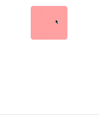

#  MovingView
### 사용자의 손가락 드래그를 통해 뷰의 위치를 쉽게 변경할 수 있는 기능을 제공하는 Swift 프로젝트입니다.

사용한 기능
LongPressGesture: 사용자가 화면을 길게 누르는 제스처를 감지합니다.
UILongPressGestureRecognizer.location: 제스쳐가 발생한 곳의 위치를 파악합니다.
UIBezierPath: 뷰의 테두리를 세련되게 디자인하는 데 사용됩니다.

[블로그 설명 바로가기](https://hhproject.me/entry/iOS-Swift-TagCalendar-%EC%BB%B4%ED%8F%AC%EB%84%8C%ED%8A%B8-1-%EC%9D%B4%EB%8F%99%ED%95%98%EB%8A%94-%EB%B7%B0-%EB%A7%8C%EB%93%A4%EA%B8%B0)
